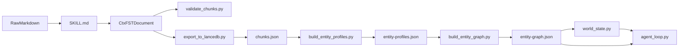

# skill-chunk-md

> **Context-first Markdown for RAG & Agents. Convert raw notes into structured CtxFST documents — a semantic world model format with chunks, entities, auto-inferred operational edges, and world state tracking.**

`skill-chunk-md` is the reference implementation for the `ctxfst` workflow: a [Claude skill](https://github.com/anthropics/anthropic-cookbook/tree/main/misc/prompt_caching_examples) plus validation, export, graph builder, world state, and a complete closed-loop agent runtime that turns plain Markdown into a deterministic planning surface for LanceDB, Lance Graph, HelixDB, LightRAG, HippoRAG, and other modern RAG/Agent stacks.

CtxFST provides the full semantic backbone for your data:
- `entities[]` define the world model (skills, states, actions, goals)
- `chunks[]` provide the context-rich retrieval payload
- Downstream tools build `<Entity -> Entity>` similarity and causal edges automatically

## Why this exists

Normal chunking pipelines often flatten context into a single embedding string. That is easy to ingest, but hard to inspect, validate, or reuse across vector search, filters, and graph retrieval.

`skill-chunk-md` keeps those concerns separate:
- `context` stays structured metadata
- `content` stays clean passage text
- `entities` stay canonical graph nodes

That makes the resulting documents easier to review, easier to validate, and easier to load into both vector and graph systems.

## 60-second quickstart

Use the included example to see the full pipeline end-to-end:

1. Convert Markdown to CtxFST with [`SKILL.md`](SKILL.md), or inspect the existing example at [`assets/examples/after.md`](assets/examples/after.md).
2. Validate the structured document:

   ```bash
   python3 scripts/validate_chunks.py assets/examples/after.md
   ```

3. Export `chunks.json`:

   ```bash
   python3 scripts/export_to_lancedb.py assets/examples/after.md --output chunks.json --pretty
   ```

4. Build `entity-profiles.json`:

   ```bash
   python3 scripts/build_entity_profiles.py chunks.json --output entity-profiles.json
   ```

5. Build `entity-graph.json` (auto-infers `REQUIRES`/`LEADS_TO` causal edges):

   ```bash
   python3 scripts/build_entity_graph.py entity-profiles.json --output entity-graph.json
   ```

6. Initialize an agent World State tracking session:

   ```bash
   python3 scripts/world_state.py init --goal "entity:learn-kubernetes-path" --seed "entity:has-raw-resume" --output state.json
   ```

7. Run the closed-loop agent runtime:

   ```bash
   python3 scripts/agent_loop.py state.json --skill-dir tests/test-skills/ --dry-run --lookahead 3 --explain
   ```

   Output:
   ```
   [Step 1] Plan (3 steps): analyze-resume → match-skills → generate-plan
   [Step 1]   Step 1: analyze-resume
   [Step 1]     pre  ✓  entity:has-raw-resume
   [Step 1]     post +  entity:has-parsed-resume
   ...
   [Step 3]     post +  entity:learn-kubernetes-path ← GOAL
   ✅ Loop finished: goal_reached  Iterations: 3
   ```

Pipeline overview:



For a shareable end-to-end sample, see [`assets/examples/career/`](assets/examples/career/), which includes the raw Markdown input, the converted CtxFST document, the exported `chunks.json`, the derived `entity-profiles.json`, and the final `entity-graph.json`.

### Why chunk your Markdown?

When you feed a long document to an LLM, retrieval can be imprecise.  
`<Chunk>` tags + structured frontmatter act as **semantic anchors** — they help Claude locate and reference specific sections precisely.

```markdown
# Before
I know Python, React, and Docker.

# After
---
entities:
  - id: entity:python
    name: Python
    type: skill
chunks:
  - id: skill:python
    tags: [Python, Backend]
    entities: [entity:python]
    context: "Author's Python skills for data pipelines and APIs"
---

<Chunk id="skill:python">
## Python
**Proficiency**: Advanced  
**Context**: Used for data pipelines and APIs with FastAPI.
</Chunk>
```

---

## Quick start

### 1. Install the skill

Use [`SKILL.md`](SKILL.md) directly in your Claude project, or download [`skill-chunk-md.skill`](https://github.com/ctxfst/skill-chunk-md/releases/latest/download/skill-chunk-md.skill).

### 2. Ask Claude to chunk your document

```
Convert this document into CtxFST format with proper <Chunk> tags and YAML frontmatter.
```

Claude will:
- Analyze semantic boundaries
- Extract and normalize canonical entities
- Generate meaningful chunk IDs
- Create YAML frontmatter with context, tags, and entity links
- Wrap content in `<Chunk>` tags

---

## What's included

```
skill-chunk-md/
├── SKILL.md                     # Main skill instructions
├── schema.json                  # JSON Schema (Draft-07) for CtxFST exports
├── entity-graph-schema.json     # Graph edge relation schema
├── world-state-schema.json      # World state session schema
├── scripts/
│   ├── validate_chunks.py       # Validate chunk syntax & frontmatter
│   ├── diagnose_chunks.py       # Diagnose chunk quality (static analysis)
│   ├── export_to_lancedb.py     # Export chunks to JSON/LanceDB
│   ├── build_entity_profiles.py # Build derived entity profiles
│   ├── build_entity_graph.py    # Build Entity->Entity similarity & causal edges
│   ├── world_state.py           # Manage agent runtime session state
│   ├── skill_selector.py        # Relation-aware routing, lookahead planning, explanations
│   ├── agent_loop.py            # Closed-loop agent runtime with critique interface
│   └── contextualize_chunks.py  # Generate contextual descriptions (LLM)
├── tests/
│   ├── test_agent_loop.py       # 66 end-to-end tests for the agent runtime
│   └── test-skills/             # 3-skill chain used by the demo and tests
├── promotion/
│   └── launch-kit.md            # Reusable copy for GitHub, HN, Reddit, Discord, X
├── references/
│   ├── ctxfst-spec.md           # Formal CtxFST specification (v2.0)
│   ├── chunk-syntax.md          # Complete <Chunk> tag reference
│   ├── entity-format.md         # Entity schema and field reference
│   ├── entity-profiles-format.md# Derived entity profiles format reference
│   └── semantic-chunking.md     # Chunking methodology
└── assets/examples/
    ├── before.md                # Sample: plain Markdown
    ├── after.md                 # Sample: CtxFST format
    └── career/                  # End-to-end career demo packet
```

---

## Schema Versioning & Stability

CtxFST is a **stable, versioned specification**. We define exact constraints so downstream parsers and graph importers don't break. 

If you are building an integration, see the definitive specifications:
1. **[CtxFST Formal Specification (v2.0)](references/ctxfst-spec.md)** (Markdown)
2. **[JSON Schema](schema.json)** (Machine-readable Draft-07)

### Layer Compatibility & Strict Superset Guarantee
CtxFST v2.0 is a strictly backward-compatible superset of all v1.x formats.
- **Vector-only RAG**: Ignore entities, just read `chunks[]`
- **GraphRAG**: Read `entities[]` + `SIMILAR` edges, ignore operational fields
- **Agentic World Model**: Read the full graph + states + causal edges + tracking logic

A basic parser will never crash on a full world model document. Unrecognized fields are safely ignored.

---

## Frontmatter Format

CtxFST uses **YAML frontmatter** to store chunk metadata separately from content:

```yaml
---
entities:
  - id: entity:python
    name: Python
    type: skill
    aliases: [python3]
  - id: entity:go
    name: Go
    type: skill
    aliases: [golang]
chunks:
  - id: skill:python
    tags: [Python, Backend, API]
    entities: [entity:python]
    context: "Author's Python skills for REST APIs and data pipelines"
    created_at: "2026-02-03"
    version: 1
    type: text
    priority: high
    dependencies: []
  - id: skill:go
    tags: [Go, Microservices]
    entities: [entity:go]
    context: "Go programming for high-performance services"
    created_at: "2026-01-15"
    version: 1
---
```

### Core Fields

#### Document Level
| Field | Type | Required | Purpose |
|-------|------|----------|---------|
| `entities` | array | No | Canonical entity catalog for the document |
| `chunks` | array | ✅ Yes | Catalog of chunks and their metadata |

#### Entity Level (`entities[]`)
| Field | Type | Required | Purpose |
|-------|------|----------|---------|
| `id` | string | ✅ Yes | Unique entity identifier (e.g., `entity:python`) |
| `name` | string | ✅ Yes | Canonical human-readable name |
| `type` | string | ✅ Yes | Entity classification (skill, tool, concept, etc.) |
| `aliases` | array | No | Alternative names or acronyms |

#### Chunk Level (`chunks[]`)
| Field | Type | Required | Purpose |
|-------|------|----------|---------|
| `id` | string | ✅ Yes | Unique chunk identifier (category:topic) |
| `tags` | array | No | Broad classification tags for RAG filtering |
| `entities` | array | No | List of entity IDs discussed in this chunk |
| `context` | string | No | 50-100 token description of chunk content |

### 2026 RAG Extension Fields

| Field | Type | Purpose |
|-------|------|---------|
| `created_at` | ISO date | Temporal RAG — enables point-in-time retrieval |
| `version` | integer | Version control for knowledge base updates |
| `type` | enum | Multi-modal support: text, image, video, audio |
| `priority` | enum | Agent hints: high, medium, low |
| `dependencies` | array | List prerequisite chunk IDs for context |

### Why Frontmatter?

| Benefit | Description |
|---------|-------------|
| **Structured data** | Easy to parse for vector DBs |
| **Separated concerns** | Context as metadata, content stays clean |
| **LanceDB ready** | Store context, content, tags as columns |
| **Graph DB ready** | `entities` array maps directly to nodes for Lance Graph and HelixDB |
| **GraphRAG enabled** | Tags and chunk links build the semantic graph for LightRAG/HippoRAG |
| **Agentic RAG** | Priority & dependencies guide agent retrieval strategy |
| **Temporal RAG** | `created_at` & `version` enable historical queries |

---

## The `<Chunk>` pattern

```markdown
<Chunk id="category:topic">
Your content here...
</Chunk>
```

### ID categories

| Category | Use Case | Example |
|----------|----------|---------|
| `skill:` | Technical skills | `skill:python-async` |
| `about:` | Background info | `about:experience` |
| `project:` | Projects | `project:payment-gateway` |
| `principle:` | Guidelines | `principle:security-first` |

---

## Export to LanceDB

Use the included script to export chunks for vector database ingestion:

```bash
python3 scripts/export_to_lancedb.py your-document.md --output chunks.json
```

Output format (with 2026 RAG extensions and entities):
```json
{
  "entities": [
    {
      "id": "entity:python",
      "name": "Python",
      "type": "skill"
    }
  ],
  "chunks": [
    {
      "id": "skill:python",
      "context": "Author's Python skills...",
      "content": "## Python\n...",
      "tags": ["Python", "Backend"],
      "entities": ["entity:python"],
      "created_at": "2026-02-03",
      "version": 1,
      "type": "text",
      "priority": "high",
      "dependencies": [],
      "source": "path/to/file.md"
    }
  ]
}
```

Use this JSON directly with:
- **LanceDB** — Import as table with structured columns
- **Graph Databases** — Read `entities` as nodes and chunk linkage as edges for **Lance Graph** and **HelixDB**
- **LightRAG / HippoRAG** — Build entity embedding graphs from `entities` and chunk links
- **LlamaIndex** — Hybrid retrieval with priority-based reranking
- **LangGraph** — Agent-directed chunk selection via priority field

---

## Build an Entity Graph

Once you have exported `chunks.json`, you can add a derived entity layer without changing the CtxFST schema:

```bash
python3 scripts/build_entity_profiles.py chunks.json --output entity-profiles.json
```

The profiles builder emits one derived record per entity:

- `mentioned_chunks` — reverse links derived from `chunks[].entities`
- `contexts` — linked chunk contexts aggregated per entity
- `keywords` — lightweight usage terms extracted from linked chunks
- `representation` — downstream embedding text built from the entity plus its linked usage context

Example:

```json
{
  "entities": [
    {
      "id": "entity:fastapi",
      "mentioned_chunks": ["skill:python"],
      "keywords": ["apis", "pipelines", "python"],
      "representation": "name: FastAPI\ntype: framework\nmentioned_in_chunks:\n- Python programming skills focusing on data pipelines and REST APIs using FastAPI and Pandas"
    }
  ]
}
```

This is a **derived pipeline layer**, not part of the core `ctxfst` schema. It keeps the standard clean while still giving GraphRAG-style systems a ready-to-embed entity representation.

### Build the similarity graph

Then build downstream `Entity -> Entity` similarity edges:

```bash
python3 scripts/build_entity_graph.py entity-profiles.json --output entity-graph.json
```

The graph builder emits:

- `nodes` — one node per canonical entity, passing through world model fields (`preconditions`, `postconditions`, `related_skills`)
- `edges` — multiple relation types:
  - `SIMILAR`: scored by cosine similarity
  - `REQUIRES` / `LEADS_TO`: auto-inferred causal edges based on state pre/postconditions
- `meta` — build settings (`mode`, `top_k`, `min_score`, `vectorizer`)

Example:

```json
{
  "meta": {
    "mode": "contextual",
    "vectorizer": "tfidf-cosine",
    "inferred_edge_count": 2
  },
  "nodes": [
    {
      "id": "entity:python",
      "name": "Python",
      "type": "skill",
      "mention_count": 3
    }
  ],
  "edges": [
    {
      "source": "entity:python",
      "target": "entity:fastapi",
      "relation": "SIMILAR",
      "score": 0.7421
    },
    {
      "source": "entity:learn-python",
      "target": "entity:has-python-skill",
      "relation": "LEADS_TO",
      "properties": {"inferred_via": "entity:has-python-skill"}
    }
  ]
}
```

### Builder modes

- `--mode metadata` — build similarity from entity metadata only (`name`, `type`, `aliases`)
- `--mode contextual` — use the derived `representation` text or aggregate linked chunk context when reading `chunks.json`

### Common tuning flags

- `--top-k 3` — keep up to 3 neighbors per entity before deduping
- `--min-score 0.15` — discard weak similarity edges

These scripts are **reference builders**. They use lightweight text aggregation plus TF-IDF cosine similarity, so they work without an external embedding model. If you later switch to a stronger embedding backend, the CtxFST format does not need to change.

---

## Run the Closed-Loop Agent Runtime

Once you have an `entity-graph.json` and a world state file, `agent_loop.py` orchestrates the full planner → executor → world-state loop.

```bash
python3 scripts/agent_loop.py state.json --skill-dir tests/test-skills/ --dry-run
```

### CLI flags

| Flag | Purpose |
|------|---------|
| `--dry-run` | Execute all steps automatically (default) |
| `--interactive` | Pause at each step with y/s/a prompt |
| `--lookahead N` | BFS multi-step planning up to N depth |
| `--explain` | Print relation-specific explanation for each selection |
| `--critique` | Interactive plan critique before each step (auto-sets `--lookahead 5`) |
| `--graph FILE` | Append `COMPLETED` edges back to `entity-graph.json` after each step |
| `--max-iter N` | Stop after N iterations (default 20) |

### How routing works

`skill_selector.py` uses **weighted Dijkstra** over the entity graph to measure goal proximity:

| Edge relation | Weight |
|---------------|--------|
| `REQUIRES` / `LEADS_TO` | 1 (causal path) |
| `EVIDENCE` / `IMPLIES` | 2 |
| `SIMILAR` | 3 (semantic neighbor) |
| `COMPLETED` / `BLOCKED_BY` | skipped |

Skills on the causal path to the goal rank above semantically-similar alternatives. Every selection decision names the specific edge relation that drove it.

### Interactive plan critique

With `--critique`, the loop presents the full plan before each execution step and accepts human commands:

```
Best plan (3 steps): analyze-resume → match-skills → generate-plan
  Step 1: analyze-resume   pre ✓ entity:has-raw-resume

Commands: [a]ccept  [s]kip <skill>  [f]orce <skill>  [r]eset  [q]uit
> s match-skills
♻️  Replanning without 'match-skills'...
```

The planner replans immediately on every command. `force` checks preconditions before accepting.

### Tests

66 end-to-end tests in `tests/test_agent_loop.py` cover happy path, failure tolerance, goal-aware routing, relation-aware routing, multi-step planning, explanation output, and all critique commands. No LLM required — the planning loop is fully deterministic.

```bash
python3 -m pytest tests/test_agent_loop.py -v
```

---

## How Entity Similarity Is Produced

The `entities` catalog does **not** directly store entity similarity. CtxFST first gives downstream systems a clean set of canonical graph nodes, and the similarity graph is computed afterward by embeddings or graph algorithms.

Think of the format as three layers:

1. **Entity catalog** — `entities[]` defines the canonical nodes
2. **Chunk linkage** — `chunks[].entities` connects passages to those nodes
3. **Similarity graph** — an embedding pipeline creates `Entity -> Entity` similarity edges

### Minimal workflow

```text
Read entities[]
  -> build an entity representation
  -> embed each representation
  -> compare vectors with cosine similarity
  -> create edges for close entities
```

### Option A: Embed the entity metadata only

```text
name: FastAPI
type: framework
aliases: []
```

This is simple, but often too shallow for high-quality graph structure.

### Option B: Embed the entity plus linked chunk context

Use the chunks linked through `chunks[].entities` to build a richer representation:

```text
name: FastAPI
type: framework
mentioned in chunks:
- Python backend skills focused on REST APIs and service implementation
- Python skills for API development, service work, and data processing
related entities:
- Python
- Pandas
```

This usually produces better similarity because it reflects how the concept is actually used in your documents, not just its name.

### What CtxFST stores vs what the graph system computes

| Layer | Produced by CtxFST | Produced later |
|-------|--------------------|----------------|
| Canonical entities | Yes | |
| Chunk -> Entity edges | Yes | |
| Entity vectors | | Yes, by an embedding model |
| Entity -> Entity similarity | | Yes, by cosine similarity or graph embedding |

So if you want an entity embedding graph:

- CtxFST gives you the clean node inventory and chunk links
- your embedding pipeline gives you the similarity edges

That is exactly why the `entities` layer matters: it stabilizes the graph inputs before similarity is computed.

### Example: Importing to a Graph Database

Because the schema natively separates nodes and edges, inserting into neo4j, Lance Graph, or HelixDB is a direct mapping:

```python
# 1. Entities become nodes
for e in document['entities']:
    graph.add_node(e['id'], label='Entity', name=e['name'], type=e['type'])

# 2. Chunks become nodes
for c in document['chunks']:
    graph.add_node(c['id'], label='Chunk', text=c['content'])

# 3. chunks[].entities become edges
for c in document['chunks']:
    for e_id in c.get('entities', []):
        graph.add_edge(c['id'], e_id, relation='MENTIONS')
```

---

## Upgrade Path

If you are using this skill as the starting point for GraphRAG, the usual progression is:

1. **Chunk the document** into valid CtxFST
2. **Extract canonical entities** and link chunks with `chunks[].entities`
3. **Build entity representations** from entity metadata or linked chunk context
4. **Compute entity similarity** with embeddings or graph algorithms
5. **Load nodes and edges** into Lance Graph, HelixDB, Neo4j, or another graph backend
6. **Use graph traversal + chunk retrieval** at query time

In short:

- this skill produces the structured document layer
- your embedding pipeline produces the similarity layer
- your graph database or GraphRAG system produces the runtime retrieval layer

That is the intended upgrade path from **CtxFST document** to **entity graph** to **full GraphRAG workflow**.

---

## Validation

Use the included script to validate your chunked documents:

```bash
python3 scripts/validate_chunks.py your-document.md
```

Checks for:
- ✅ Frontmatter contains `chunks` and optionally `entities` catalogs
- ✅ Entity definitions are valid (id, name, type) and unique
- ✅ Chunk `entities` references match document entities
- ✅ All `<Chunk>` IDs match frontmatter
- ✅ Unique chunk IDs
- ✅ Properly closed tags
- ✅ No nested chunks
- ✅ Temporal fields (ISO date format, valid version numbers)
- ✅ Agentic fields (valid priority values, dependency references)
- ✅ Multi-modal fields (valid type values, referenced file paths)

---

## Diagnostics

Analyze chunk quality before RAG ingestion. You can use **conversation** or **CLI**.

### Method 1: Ask Claude (Recommended)

Just paste your document and ask:

```
Diagnose this document's chunk quality and give me suggestions
```

Claude will analyze according to the skill and respond with issues + suggestions. No API key needed — Claude does the analysis directly.

**Intervention levels:**
- **Level 1 (diagnose)**: "Check chunk quality and mark problems"
- **Level 2 (suggest)**: "Diagnose and give me modification suggestions"
- **Level 3 (fix)**: "Auto-fix chunk issues and let me review"

### Method 2: CLI Script (Batch Processing)

For automation or processing multiple files:

```bash
# Level 1: Identify problems
python3 scripts/diagnose_chunks.py doc.md --level diagnose

# Level 2: Get modification suggestions
python3 scripts/diagnose_chunks.py doc.md --level suggest

# Level 3: Auto-generate fixes for review
python3 scripts/diagnose_chunks.py doc.md --level fix

# JSON output for LLM processing
python3 scripts/diagnose_chunks.py doc.md --level suggest --json
```

> **Note**: The CLI script uses static analysis only. No API key required.

### What Gets Checked

| Check | What It Detects |
|-------|-----------------|
| 🔄 Semantic similarity | Chunk pairs that may confuse retrieval |
| 📝 Context quality | Too short, too vague, or just repeating content |
| 🏷️ Tag overlap | Identical tags across chunks, reducing filter effectiveness |
| 🆔 ID naming | Inconsistent category prefixes, invalid format |
| 👻 Entity noise | Generic or low-value entities |
| 👯 Entity duplication | Aliases that should be merged into one canonical node |
| 🔗 Entity linking | Chunks with missing, excessive, or irrelevant entity links |

---

## Part of CtxFST

This skill is part of the [CtxFST](https://github.com/ctxfst) ecosystem.

**Related skills:**
- `skill-chunk-mdx` (coming soon)
- `skill-chunk-pdf` (coming soon)

---

## License

MIT — Fork it, adapt it, share it.

---

**Maintained by**: [ctxfst](https://github.com/ctxfst)
